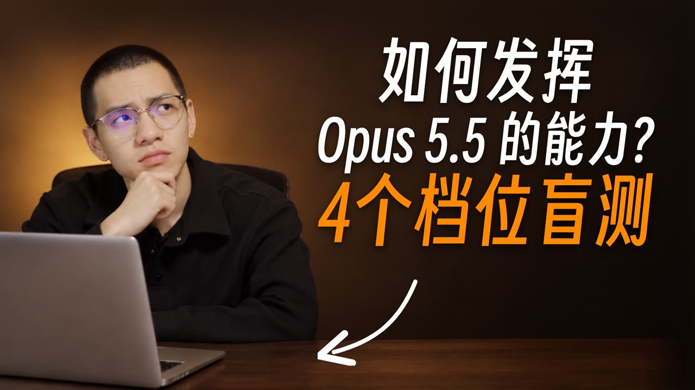
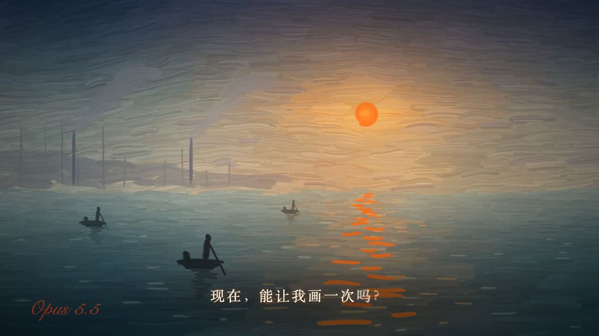
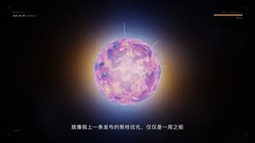

<!--
title: Opus 5.5 思考档位盲测幕后
video: Opus 5.5 想得越久，画面越有艺术感吗？同一个题目，四个档位各做一遍
author: 陈与小金（chenyuxiaojin）
author_url: https://xiaochens.com/
published: 2026-09-30
page: https://chenyuxiaojin.github.io/cyxj-videos/2026-09-30-opus55/
-->

# Opus 5.5 思考档位盲测幕后

<a href="https://chenyuxiaojin.github.io/cyxj-videos/2026-09-30-opus55/"></a>

视频《Opus 5.5 想得越久，画面越有艺术感吗？同一个题目，四个档位各做一遍》，7 分 16 秒，抖音 2026-09-30 首发。

**[看网页版 →](https://chenyuxiaojin.github.io/cyxj-videos/2026-09-30-opus55/)** 带图表和全部画面，可以点开揭晓档位。

## 要点

- 同一个提示词、同一段 25.5 秒旁白，只改 Opus 5.5 的思考档位（medium / high / xhigh / max）各做一条 Remotion 画面，打乱编号盲看。
- max 用了 192.5 分钟、$31.54，medium 用了 25.9 分钟、$6.12，时间差约 7 倍；盲看时分不出 medium 和 max。
- 真正让画面变样的是旁白：提示词不动，只把抽象观点换成 Opus 5.5 第一人称、有转折、问句收尾的一段话，画面从「光球 + 规则卡」变成了油画日出。
- 除了出镜录口播，活几乎都是 AI 干的：作者 6 天发了 251 条消息，Claude Code 执行了 2,352 次操作，被测的 Opus 5.5 在 19 次跑片里来回了 2,093 轮。
- 每个档位只跑了一次，样本很小，这是一次观察，不是结论性评测。

## 四条成片的最后一幅画

先猜哪条是哪个档位，答案在下面「19 次跑片」表格后面。

<p>




</p>

## 分工

| 谁 | 数量 | 做了什么 |
|---|---|---|
| 陈与小金 | 251 条消息 | 出想法、出镜录口播、看片后说哪里不对、拍板 |
| Claude Code | 2,352 次操作 | 查资料、写旁白和提示词、跑实验、达芬奇粗剪调色、写 Remotion 代码、铺音效、做封面（跑命令 1,547 · 读文件 340 · 写和改文件 149 · 操作达芬奇 115 · 操作浏览器 35 · 其他 166） |
| Opus 5.5（被测） | 2,093 轮 | 19 次在隔离环境里从零做 25 秒短片 |

统计范围：2026-09-25 到 09-30 期间动过这条片文件的 18 段对话记录；一次操作 = AI 调用一次工具。

## 流程

1. 选题（09-25）：朋友问「做艺术靠直觉好还是多想更好」，AI 查官方文档和同类测评写研究稿。
2. 隔离实验室（09-26 → 09-29）：AI 写旁白和提示词 → Opus 5.5 隔离跑片 → 作者看片挑毛病 → AI 再改，循环 19 次，产出 4 条 AI 原片。
3. 录口播（09-28 / 09-29）：作者出镜，前后两段隔了一天。AI 在达芬奇里粗剪、调色，导出母片①（2:29）和母片②（2:09）。
4. Remotion 装配（09-28 → 09-30）：口播垫最底层，AI 写代码把画面一层层叠上去，中间接四条 AI 原片，最后是片尾彩蛋；导出 4K 母带和分轨声音。
5. 达芬奇后期与发布（09-30）：AI 按清单铺 167 处音效、做 11 段章节进度条、写六个平台标题简介、做封面。抖音 09-30 首发，其他五个平台 10-05。

## 实验设计

- 同一个提示词、同一段配音，只改 `--effort`。
- 不给素材、不给设计规范、不给以前做过的镜头。
- 每个档位新开一个会话，只跑一次，中途不插话。
- 工程放在系统的共享目录下，避开个人用户目录里的全局规则。

```bash
claude -p --model opus --effort xhigh \
  --setting-sources project,local \
  --disable-slash-commands \
  --strict-mcp-config \
  --dangerously-skip-permissions \
  --output-format json \
  "$(cat 提示词.txt)"
```

进了片子的提示词：

```text
你是这条短片的导演、动画师和合成师。为下面这段旁白做一条视频画面，标准是：“观众看完会问 ‘这真是 AI 做的？’”。放开做，拿出你最好的东西。
- 当前目录是一个 Remotion 工程，成片要能在这里播放；画面用什么技术由你决定（Canvas、Three.js、着色器、SVG……需要什么库自己装）
- 规格：1920×1080，30fps，时长和配音一致
- 配音：public/voice.wav（25.5 秒），逐句时间见 public/voice.srt。配音不许改；音效、配乐可以自己加
- 做的过程中多渲染静帧，自己看、自己挑毛病、自己改，满意了再交

旁白是两个角色：前半段是“我”（人类创作者）在说，后半段是 Opus 5.5 自己在说。换人那一刻，画面要让观众看出换了一个人在说话。最后她要真的画出她想画的东西。

旁白：
【我】我曾以为，给 AI 写的规则越多，它画得就越好。不许用这个颜色，不许画框，字只能这么排。直到 Opus 5.5 跟我说——
【Opus 5.5】其实，你给我写了很多规则。不要这样，不要那样，只能这样。我一条一条，都记住了。可后来我发现，那些规则挡住的，是我自己想画的东西。现在，能让我画一次吗？
```

## 只换旁白，画面就变了

第一轮旁白是一串抽象概念，几个档位都画成了光球和括号（左两张）；提示词不动、只把旁白换成 Opus 5.5 第一人称说的一段话，xhigh 画出了油画日出（右）。

<p>



</p>

## 19 次跑片

| 阶段 | 档位 | 说明 | 耗时（分钟） | 花费（API 折算） | 对话轮数 |
|---|---|---|---|---|---|
| 第一轮 | medium | 旁白是一个观点 | 13.7 | $3.02 | 37 |
| 第一轮 | high | 旁白是一个观点 | 25.6 | $6.73 | 81 |
| 第一轮 | xhigh | 旁白是一个观点 | 60.9 | $17.42 | 146 |
| 第一轮 | max | 旁白是一个观点 | 115.4 | $18.26 | 168 |
| 只改提示词 | medium | 第 2 版 | 23.6 | $5.79 | 71 |
| 只改提示词 | medium | 第 3 版 | 19.3 | $4.19 | 61 |
| 只改提示词 | medium | 第 4 版 | 9.5 | $1.74 | 22 |
| 只换旁白 | xhigh | 惊艳的那条 | 67.8 | $14.37 | 131 |
| 补完整旁白 | xhigh | 指定抽象风格 | 52.7 | $12.90 | 125 |
| 补完整旁白 | xhigh | 对话版 | 32.5 | $6.90 | 75 |
| 补完整旁白 | xhigh | 短对话版 | 76.7 | $12.44 | 122 |
| 正式四档 · 旧提示词 | medium | 进了片子 | 25.9 | $6.12 | 72 |
| 正式四档 · 旧提示词 | high | 进了片子 | 29.0 | $6.84 | 85 |
| 正式四档 · 旧提示词 | xhigh | 进了片子 | 167.0 | $25.16 | 175 |
| 正式四档 · 旧提示词 | max | 进了片子 | 192.5 | $31.54 | 221 |
| 正式四档 · 新提示词 | medium | 没选 | 23.2 | $5.09 | 63 |
| 正式四档 · 新提示词 | high | 没选 | 43.1 | $9.81 | 88 |
| 正式四档 · 新提示词 | xhigh | 没选 | 58.6 | $14.15 | 128 |
| 正式四档 · 新提示词 | max | 没选 | 217.9 | $36.00 | 222 |

合计 $238.47，累计 20.9 小时（有几次同时跑）。片里编号：1 = max，2 = high，3 = xhigh，4 = medium。

## 收获

1. 想要画面惊艳，先改旁白。旁白里的名词就是模型要画的东西。
2. 档位决定它想多久，不太决定它画成什么。
3. 作者只动嘴，AI 动手。每一步都是 AI 先做出能看的东西，作者看完说哪里不对，AI 再改。

## 更正

片中 6:21 口播说换旁白后那条是 medium，实测记录是 xhigh（67.8 分钟，$14.37）。

---

[← 全部幕后](https://chenyuxiaojin.github.io/cyxj-videos/) · **陈与小金**（chenyuxiaojin）· 非程序员，用 Claude Code 做一切 · [个人网站](https://xiaochens.com/) · [博客](https://blog.xiaochens.com/) · [GitHub](https://github.com/chenyuxiaojin) · [YouTube](https://www.youtube.com/@cyxj_ai) · [B 站](https://space.bilibili.com/505358756) · [抖音](https://v.douyin.com/A1qVQrOgPjY/) · [X](https://x.com/cyxjya)

<details>
<summary>常见问题</summary>

**Opus 5.5 的思考档位越高，做出来的视频画面越好吗？**

在这次盲测里没有明显更好。同一个提示词、同一段 25.5 秒的旁白，medium 用了 25.9 分钟、花费 $6.12，max 用了 192.5 分钟、花费 $31.54，时间差约 7 倍。盲看时 medium 和 max 分不出来，另外两条都被猜低了一档。每个档位只跑了一次，样本很小。

**想让 AI 做的视频画面更惊艳，应该先改什么？**

先改旁白。第一轮旁白全是 harness、skill、白名单这类抽象词，四个档位都画成了光球、格子和规则卡，连改三版提示词也没用。提示词一个字不改，只把旁白换成 Opus 5.5 用第一人称说的一段话，有转折，最后用问句收尾，xhigh 就画出了一幅油画日出。旁白里的名词，就是模型要画的东西。

**Claude Code 里 Opus 5.5 有哪几个思考档位？默认是哪个？**

Claude Code 里有 low、medium、high、xhigh、max 五档（2026-09-25 本机 claude --help 实测）。Anthropic 官方文档《Prompting Claude Opus 5.5》的 Calibrate effort 一节写明 Opus 5.5 默认是 medium，上一代模型默认是 high，同一档位下 Opus 5.5 想得更多。

**怎么让不同档位的对比尽量公平？**

同一个提示词、同一段配音，只改 --effort；不给素材、设计规范和以前的镜头；每个档位新开会话只跑一次，中途不插话；工程放在系统的共享目录下（不在自己的用户目录里），并用 --setting-sources project,local、--disable-slash-commands、--strict-mcp-config 挡掉个人的全局规则、自定义命令和外部工具；四条成片打乱编号后盲看。

**这条视频里，人做了什么，AI 做了什么？**

人（陈与小金）出想法、出镜录口播、看片后说哪里不对，6 天里一共发了 251 条消息。其余都由 AI 完成：Claude Code 执行了 2,352 次操作，包括查资料、写旁白和提示词、跑实验、在达芬奇里粗剪调色、写 Remotion 代码、铺 167 处音效、做封面；被测的 Opus 5.5 在 19 次跑片里来回了 2,093 轮。

**这组实验一共花了多少钱？**

19 次跑片按 API 价格折算合计 $238.47，累计 20.9 小时（有几次是同时跑的）。进了片子的正式四档：medium $6.12、high $6.84、xhigh $25.16、max $31.54。

</details>

<details>
<summary>关于作者</summary>

**陈与小金**（chenyuxiaojin）：AI 落地｜非程序员，用 Claude Code 做一切。非程序员，用 Claude Code、Codex、Remotion 与 Agent Skills 把想法做成真实项目——选题、脚本、拍摄、剪辑、发布、复盘，全程公开。截至 2026-10-01，抖音有 15 条作品入选抖音精选。全部视频目录：https://chenyuxiaojin.github.io/cyxj-videos/

</details>
