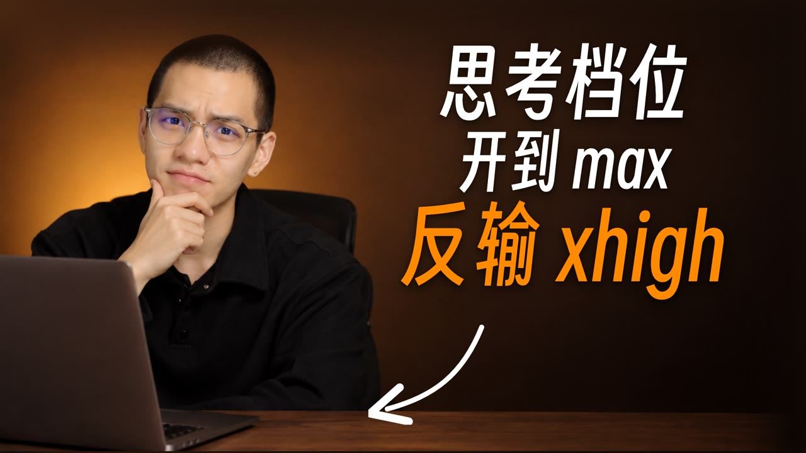

<!--
title: 特效开的哪一档：思考档位智商倒挂幕后
video: 如何选择正确的模型档位？思考档位开到 max，反输 xhigh
author: 陈与小金（chenyuxiaojin）
author_url: https://xiaochens.com/
published: 2026-10-08
page: https://chenyuxiaojin.github.io/cyxj-videos/2026-10-08-iq-inversion/
-->

# 特效开的哪一档：思考档位智商倒挂幕后

视频《如何选择正确的模型档位？》，9 分 52 秒，抖音 2026-10-08 首发。

评论区问：「这个视频的特效是开的 max 做的还是 high？」「特效、画面转场是 Opus 5.5 做的吗？」「这视频是怎么做的？」

**[看网页版 →](https://chenyuxiaojin.github.io/cyxj-videos/2026-10-08-iq-inversion/)** 有分工、全流程、每段特效的循环小片段和成片画廊。

## 答案

- 片子里盖在口播上的 12 段特效，全是 Opus 5.5 用 `claude -p` 在独立的 Remotion 工程里**写代码**做的，不是 AI 生成视频。
- **9 段 high、2 段 medium、1 段 xhigh，没有一段开 max。** 只有「第三种情况」那段 93 秒的路线图用了 xhigh（41 分钟，$10.22）。
- 章节卡、推近跳切、音效、字幕这些把片子串起来的活，由 Claude Code 在主工程里完成；相关对话记录里绝大多数回复也来自 Opus 5.5。

## 12 段特效

| # | 特效 | 成片时间 | 档位 | 耗时 | 花费 | 为这段跑过 |
|---|---|---|---|---|---|---|
| 1 | 官方证据：发布页 → 评分图 → 文档 | 0:10–0:41 | high | 13.2 分钟 | 未记 | 12 版（medium 7 · high 4 · xhigh 1） |
| 2 | 手绘泡面 + 五档科技段 | 0:53–1:25 | medium | 未记（续跑 6 轮） | 未记 | 9 版（全 medium） |
| 3 | 官方评分图：只有一条线往下掉 | 1:25–1:36 | high | 22.1 分钟 | $6.25 | 6 版（medium 1 · high 4 · xhigh 1） |
| 4 | FutureSearch：分数往下，花费往上 | 1:41–1:57 | high | 17.3 分钟 | $3.88 | 3 版（三档各 1） |
| 5 | 数水果：61% 扎进思考条 | 2:01–2:32，2:42–2:50 | high | 20.2 分钟 | $4.00 | 6 版（medium 1 · high 4 · xhigh 1） |
| 6 | 第二种情况：越改越胖的答案卡 | 3:09–3:34 | high | 16.4 分钟 | $3.02 | 1 版 |
| 7 | 第三种情况：从 A 点到 B 点 | 3:39–5:16 | xhigh | 41.1 分钟 | $10.22 | 3 版（三档各 1） |
| 8 | 官方算账：多 1.4 分，贵 2.5 倍 | 5:25–5:50，6:03–6:19 | high | 17.3 分钟 | $3.53 | 1 版 |
| 9 | 回看上期：75 次打开图片检查 | 6:19–7:09 | high | 20.8 分钟 | $4.03 | 1 版 |
| 10 | 选哪一档：橙色的档位圆点 | 7:32–8:26 | high | 20.6 分钟 | $5.10 | 1 版 |
| 11 | 我怎么选：真实的 /model 菜单 | 8:26–8:35 | high | 13.7 分钟 | $3.01 | 1 版 |
| 12 | 结论卡：默认开 xhigh | 9:01–9:06，9:44–9:52 | medium | 9.1 分钟 | $2.29 | 6 版（medium 4 · high 1 · xhigh 1） |

花费按 API 价格折算；「未记」是 10-04 到 10-05 凌晨那几批当时没存花费或时长。

## 怎么做出来的

每段画面开一个空的 Remotion 工程（用 React 写视频的框架），交给 Opus 5.5。它写代码 → 渲静帧 → 打开图片看哪里不对 → 改代码，循环到满意再交片。51 次跑片里，它一共调用工具 3,114 次，其中打开自己渲的图片检查 1,129 次（平均每次跑片 22 张）。

- 画面长什么样、用什么技术，都由它自己定。
- 进片的画面代码一共约 12,700 行。

## 为什么不开 max

重要的段 medium、high、xhigh 并排各跑一版，看完挑一版，max 一版都没跑。6 处三档对比：4 处挑 high，1 处 xhigh（第三种情况），1 处 medium（结尾卡片）。

| 5 处三档对比平均 | 耗时 | 花费 |
|---|---|---|
| medium | 12.6 分钟 | $2.87 |
| high | 19.4 分钟 | $4.21 |
| xhigh | 29.9 分钟 | $7.44 |

xhigh 比 high 平均多花约一半的时间，贵约 77%。

## 转场、音效、字幕

| 是什么 | 多少 | 说明 |
|---|---|---|
| 章节卡 | 3 张 | 照搬上一期对决段的大标签，框放大成整屏透出下一段 |
| 推近跳切 | 22 刀 | 剪过的地方在 100% 和 112% 之间换景别，把跳切遮掉 |
| 克隆音换句 | 4 句 | 念错的词用本片原声克隆重念 |
| 音效 | 298 处 | 从画面代码里导出清单，在达芬奇里铺好 |
| 章节进度条 | 6 段 | 透明底 4K 视频叠在最上面一轨 |
| 字幕 | 301 条 | 每条不超过 16 字 |

## 制作数据

- 51 次跑片分 16 批，10-05 下午一次同时开了 7 个沙盒；记得下花费的 30 次合计约 $131，记得下时长的 45 次合计约 13.5 小时。
- 进片的 12 版里，记得下花费的 10 版合计 $45.33。

## 更正

- 片中 0:20 口播「第一档的 xhigh」应为「低一档的 xhigh」，分数是 52.1。
- 9:27「豆瓣」是口误，应为「豆包」。
- 46.2 / 52.1 出自 Sonnet 5.5，不是 Opus 5.5。

---

[← 全部幕后](https://chenyuxiaojin.github.io/cyxj-videos/) · **陈与小金**（chenyuxiaojin）· 非程序员，用 Claude Code 做一切 · [个人网站](https://xiaochens.com/) · [博客](https://blog.xiaochens.com/) · [GitHub](https://github.com/chenyuxiaojin) · [YouTube](https://www.youtube.com/@cyxj_ai) · [B 站](https://space.bilibili.com/505358756) · [抖音](https://v.douyin.com/A1qVQrOgPjY/) · [X](https://x.com/cyxjya)
